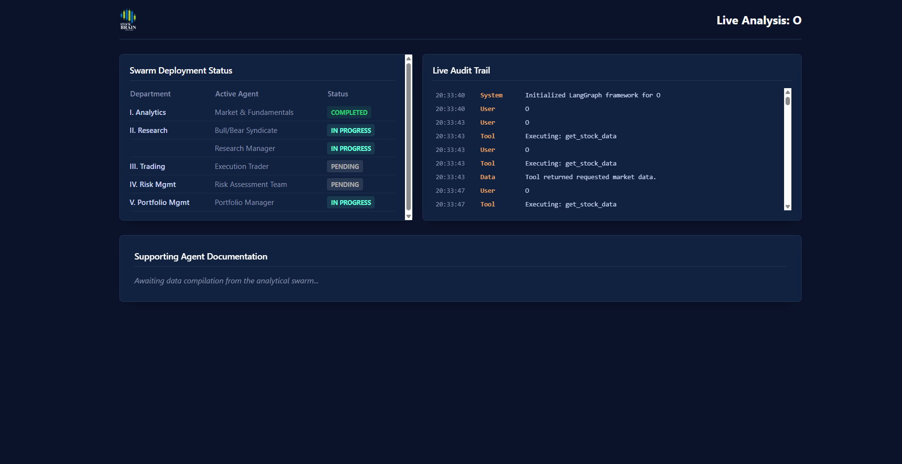
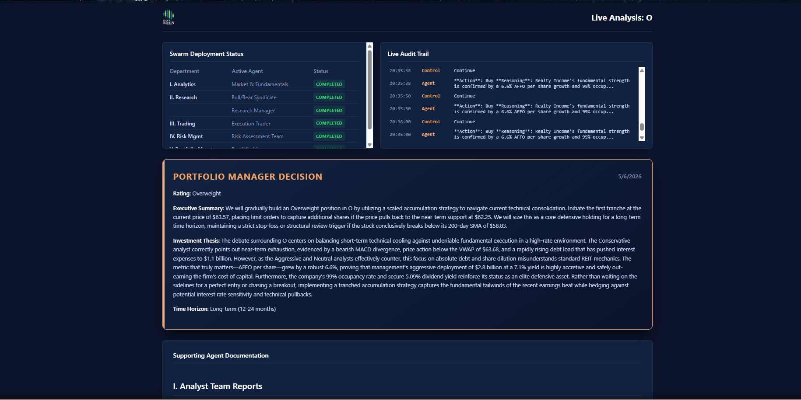

## 🖥️ StockBrain Web Dashboard

StockBrain is accessible via a premium, responsive Web UI hosted at [StockBrain.io](https://stockbrain.io). It is designed for absolute transparency, allowing users to watch the AI agents stream their internal logic and debates live before the final executive briefing is rendered.

**Platform Features:**
- **Live Audit Trail:** Watch the analytical swarm execute data-gathering tools and debate technicals in real-time.
- **Portfolio Manager Briefings:** Clean, structured, and exportable Markdown reports detailing the final trade decision and supporting evidence.
- **Institutional Styling:** Day/Night mode toggles with a sleek, professional "boardroom" aesthetic designed for high-end decision support.

<p align="center">
  
  
</p>

---

## ⚡ Developer Installation (Local Engine)

For developers, quants, or researchers looking to run the StockBrain engine locally, modify the swarm architecture, or test new LLM models, you can run the FastAPI backend on your local machine.

**1. Clone the repository:**
```bash
git clone [https://github.com/YOUR_USERNAME/StockBrain.git](https://github.com/YOUR_USERNAME/StockBrain.git)
cd StockBrain